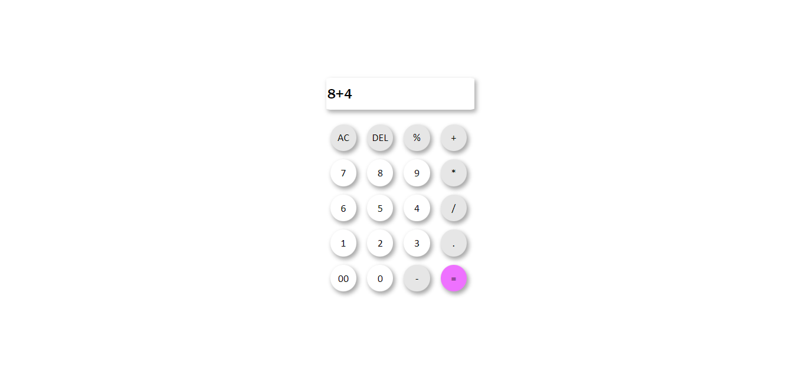

<h2>JS calculator  🧮 </h2>

This calculator can perform the four basic operations using mathematical operations in JavaScript. It has both single and universal clear functions, making it useful for simple calculations.

<h3>Features 🔥</h3>

* Basic math operations  ✔
* Remove all , Remove one by one  ✔
* neomorphism template  ✔

<h3>Goals  🎯</h3>

 Basic Math Operations with a Neomorphism style  

<h3>See Some image(s)</h3>

